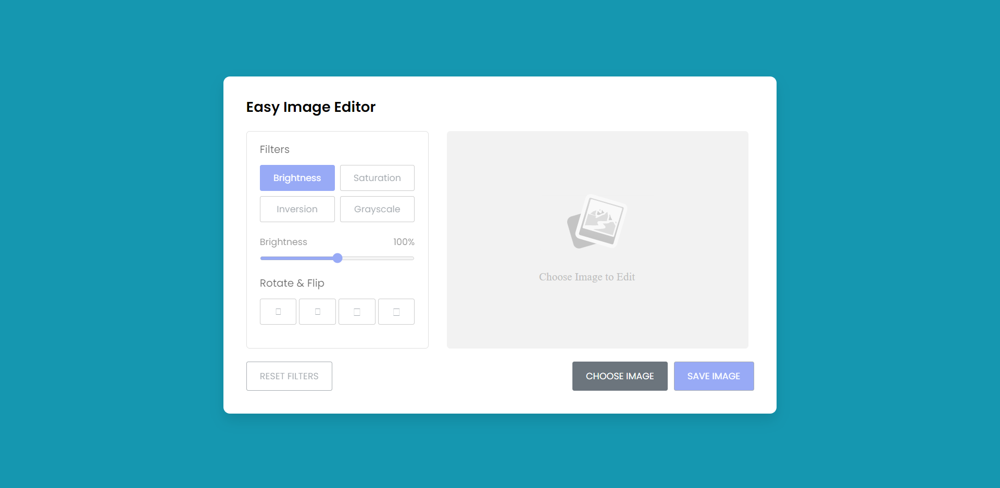

<h1 align = "center"> Image_Editor </h1>

 Web Application 

  

Its a simple HTML, CSS, JS based Image editor with some functionalities to edit the image desirably and then also providing the feature of saving the picture. 
The user saved image will be same as the canvas present in the User Selected image section.

## Demo
If anyone wants to see this application in running state, check the link given below.  
[Click here to access the link](https://image-editor-orpin.vercel.app/)
  

## Link To Video

You can also follow the tutorial throug my channel: 
[Click Here]() to access the video
  

## GUI

  

## Deployment Details
 
The website is deployed using the free hosting provided by **Vercel**

  

  
Later on the link was customized using the well known url shortner and customizer **Rebrandly**:  

  

  

## Developer
Muhammad Abdullah Butt  
abdullahbutt12292210@gmail.com  
> [Instagram](https://www.instagram.com/abdullah.butt.22/) 
> [FaceBook](https://www.facebook.com/profile.php?id=100076291614529) 
> [YouTube](https://www.youtube.com/channel/UCnuOFQyMywg-KuoN-lmav1Q) 
> [Portfolio](https://rebrand.ly/muhammadabdullahPortfolio) 
> [Website](#)
